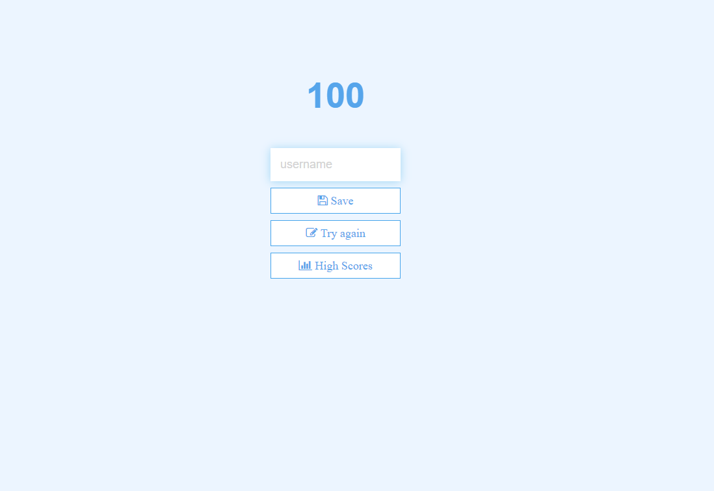

## Code Quiz

## Summary

Once start button is clicked, quiz will begin. Each question has a limit of 60 seconds to answer 4 questions about JavaScript. Each incorrect answer will be penalized with a 5 second deduction and each correct answer will be rewarded with 25 points for a maximum of 100 points.

Try it here: https://johnnylieu.github.io/Code_Quiz_HW/

## History

https://github.com/johnnylieu/Code_Quiz_HW/commits/master

## Screenshots

This is a preview of the landing page:

This is a preview of the quiz:

This is a preview of the end page:

This is a preview of the high scores:

## Credits
Special thanks to to my tutor Bobbi Tarkany for pointing me in the right direction.

I also did a ton of Googling and YouTubeing.

## License
 
* © 2019 Trilogy Education Services, a 2U, Inc. brand. All Rights Reserved.
* © UCSD Coding Bootcamp
